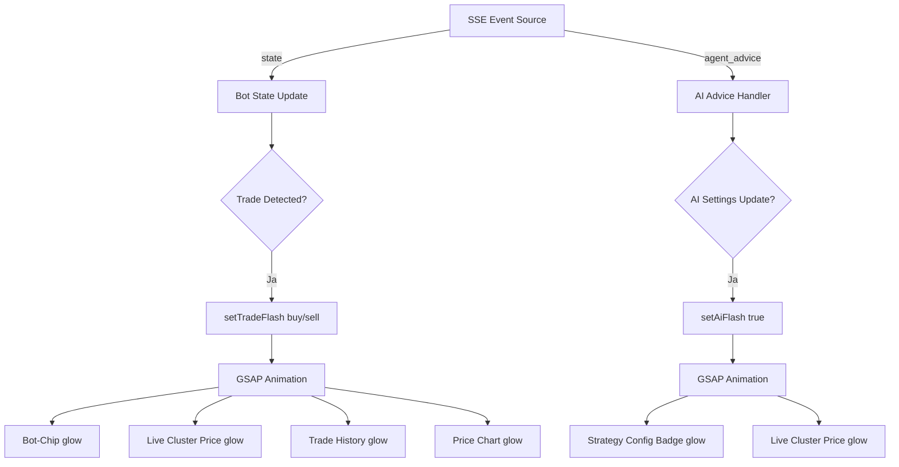

# GSAP Integration Plan - Scalpatron Trading Bot

## Übersicht
Integration von GSAP (@gsap/react) für performante Animationen bei Trading-Events im UI.

## Anforderungen
- **Kauf-Signal**: Grüne Signalfarbe (#22c55e / green-500)
- **Verkaufs-Signal**: Rote Signalfarbe (#ef4444 / red-500)
- **AI-Update-Signal**: Lila Signalfarbe (#a855f7 / purple-500)
- **Intensität**: Mittel (deutliches Leuchten mit Box-Shadow)
- **Dauer**: ~1.5s

## Betroffene UI-Komponenten
1. **Bot-Chip** (Sidebar Bot-Button)
2. **Live Cluster Price Background** (Preis-Display Card)
3. **Trade History Card**
4. **Price Chart Card**
5. **Strategy Config Badge** (AI UPDATED Badge)

## Technische Umsetzung

### 1. Installation
```bash
cd frontend
npm install gsap @gsap/react
```

### 2. CSS-Erweiterungen (frontend/src/index.css)
Neue Animationen für AI-Update-Signal hinzufügen:
```css
@keyframes ai-update-flash {
  0%   { box-shadow: 0 0 0 0 rgba(168, 85, 247, 0); }
  10%  { box-shadow: 0 0 40px 15px rgba(168, 85, 247, 0.4), inset 0 0 60px rgba(168, 85, 247, 0.15); }
  30%  { box-shadow: 0 0 60px 20px rgba(168, 85, 247, 0.3); }
  60%  { box-shadow: 0 0 30px 10px rgba(168, 85, 247, 0.15); }
  100% { box-shadow: 0 0 0 0 rgba(168, 85, 247, 0); }
}

.ai-update-flash {
  animation: ai-update-flash 1.5s ease-out forwards;
}
```

### 3. State-Erweiterung in App.tsx
Bestehenden `tradeFlash` State erweitern:
```typescript
// Vorher
const [tradeFlash, setTradeFlash] = useState<Record<string, "buy" | "sell" | null>>({});

// Nachher
const [tradeFlash, setTradeFlash] = useState<Record<string, "buy" | "sell" | null>>({});
const [aiFlash, setAiFlash] = useState<Record<string, boolean>>({});
```

### 4. GSAP Animation Hooks
Verwendung von `useGSAP` Hook für die Animationen:

```typescript
import { useGSAP } from "@gsap/react";
import gsap from "gsap";

// Für Trade-Events
useGSAP(() => {
  if (tradeFlash[botId]) {
    gsap.fromTo(`.bot-chip-${botId}`, 
      { boxShadow: "0 0 0 0 rgba(0,0,0,0)" },
      { 
        boxShadow: tradeFlash[botId] === "buy" 
          ? "0 0 40px 15px rgba(34, 197, 94, 0.4)" 
          : "0 0 40px 15px rgba(239, 68, 68, 0.4)",
        duration: 1.5,
        ease: "power2.out",
        onComplete: () => setTradeFlash(f => ({ ...f, [botId]: null }))
      }
    );
  }
}, [tradeFlash]);

// Für AI-Update-Events
useGSAP(() => {
  if (aiFlash[botId]) {
    gsap.fromTo(`.strategy-config-${botId}`,
      { boxShadow: "0 0 0 0 rgba(0,0,0,0)" },
      {
        boxShadow: "0 0 40px 15px rgba(168, 85, 247, 0.4)",
        duration: 1.5,
        ease: "power2.out",
        onComplete: () => setAiFlash(f => ({ ...f, [botId]: false }))
      }
    );
  }
}, [aiFlash]);
```

### 5. Event-Trigger Logik

#### Trade-Event (bereits vorhanden, wird optimiert)
```typescript
// Zeile ~323-335 in App.tsx
useEffect(() => {
  bots.forEach((bot) => {
    const latestTrade = bot.recentTrades?.[0];
    const currTs = latestTrade?.timestamp ?? 0;
    const prevTs = prevTradeCountRef.current[bot.id] ?? 0;
    if (currTs > prevTs && prevTs > 0) {
      const flashType = latestTrade?.action === "BUY" ? "buy" : "sell";
      setTradeFlash((f) => ({ ...f, [bot.id]: flashType }));
      // GSAP Animation wird automatisch getriggert
    }
    if (currTs > 0) prevTradeCountRef.current[bot.id] = currTs;
  });
}, [bots]);
```

#### AI-Update-Event (neu)
```typescript
// Nach dem agent_advice SSE-Handler (~Zeile 425)
useEffect(() => {
  if (data.botId && data.advice?.adjustedSettings) {
    // ... bestehende Logik für botSettingsChanges ...
    
    // AI-Flash Animation triggern
    setAiFlash((f) => ({ ...f, [data.botId]: true }));
    setTimeout(() => setAiFlash((f) => ({ ...f, [data.botId]: false })), 1500);
  }
}, [agentAdvice]);
```

### 6. Komponenten-Updates

#### Bot-Chip (Sidebar Button)
```typescript
// Zeile ~1413 in App.tsx
<span 
  className={`w-2.5 h-2.5 rounded-full shrink-0 ${
    isRunning 
      ? "bg-green-500 " + (backgroundPulseTrigger ? "animate-pulse-trigger" : "animate-pulse") + " shadow-[0_0_6px_#22c55e]" 
      : "bg-zinc-600 " + (backgroundPulseTrigger ? "animate-pulse-trigger" : "")
  }`}
/>
```

#### Live Cluster Price Card
```typescript
// Zeile ~1773 in App.tsx
<div className={`bg-primary/5 rounded-lg border-0 shadow-lg relative overflow-hidden transition-all duration-300 ${
  tradeFlash[selectedBot.id] === "buy" ? "glow-green" : 
  tradeFlash[selectedBot.id] === "sell" ? "glow-red" : 
  aiFlash[selectedBot.id] ? "glow-purple" : ""
}`}>
```

#### Trade History & Price Chart Cards
```typescript
// Zeile ~2239 und ~2287 in App.tsx
<Card className={`relative overflow-hidden ... ${
  tradeFlash[selectedBot.id] === "buy" ? "trade-flash-buy" : 
  tradeFlash[selectedBot.id] === "sell" ? "trade-flash-sell" : 
  aiFlash[selectedBot.id] ? "ai-update-flash" : ""
}`}>
```

#### Strategy Config Badge
```typescript
// Zeile ~1927 in App.tsx
{botSettingsChanges[selectedBot.id] ? (
  <span className={`flex items-center gap-1 bg-linear-to-r from-purple-600 to-cyan-500 text-white text-[8px] font-bold px-1.5 py-0.5 rounded shadow-sm shadow-purple-500/30 ${
    aiFlash[selectedBot.id] ? "animate-pulse glow-purple" : "animate-pulse"
  }`}>
    <BrainCircuit className="h-2 w-2" /> AI UPDATED · {...}
  </span>
) : null}
```

## Datenfluss-Diagramm



## Performance-Optimierung

1. **GSAP Context Cleanup**: Jeder useGSAP Hook bereitet sich selbst auf
2. **RequestAnimationFrame**: GSAP verwendet intern RAF für optimale Performance
3. **CSS Will-Change**: Für animierte Elemente `will-change: box-shadow` setzen
4. **Debouncing**: Bei schnellen Events Animationen nicht überlappen lassen

## Testing-Checkliste

- [ ] Kauf-Signal löst grünes Aufglühen aus (Bot-Chip, Price, Trade History, Chart)
- [ ] Verkaufs-Signal löst rotes Aufglühen aus
- [ ] AI-Update löst lila Aufglühen aus (Strategy Badge, Price)
- [ ] Animationen sind flüssig (~60fps)
- [ ] Keine UI-Verzögerungen bei Animationen
- [ ] Animationen überschreiben sich nicht gegenseitig
- [ ] Live Feed Events werden korrekt angezeigt

## Dateiliste

| Datei | Änderungen |
|-------|------------|
| `frontend/package.json` | gsap, @gsap/react hinzufügen |
| `frontend/src/index.css` | AI-Update-Animation, glow-Klassen |
| `frontend/src/App.tsx` | GSAP-Hooks, State-Erweiterung, Event-Handler |

## Nächste Schritte

1. Code-Mode wechseln
2. Pakete installieren
3. CSS erweitern
4. App.tsx anpassen
5. Testing im Browser
